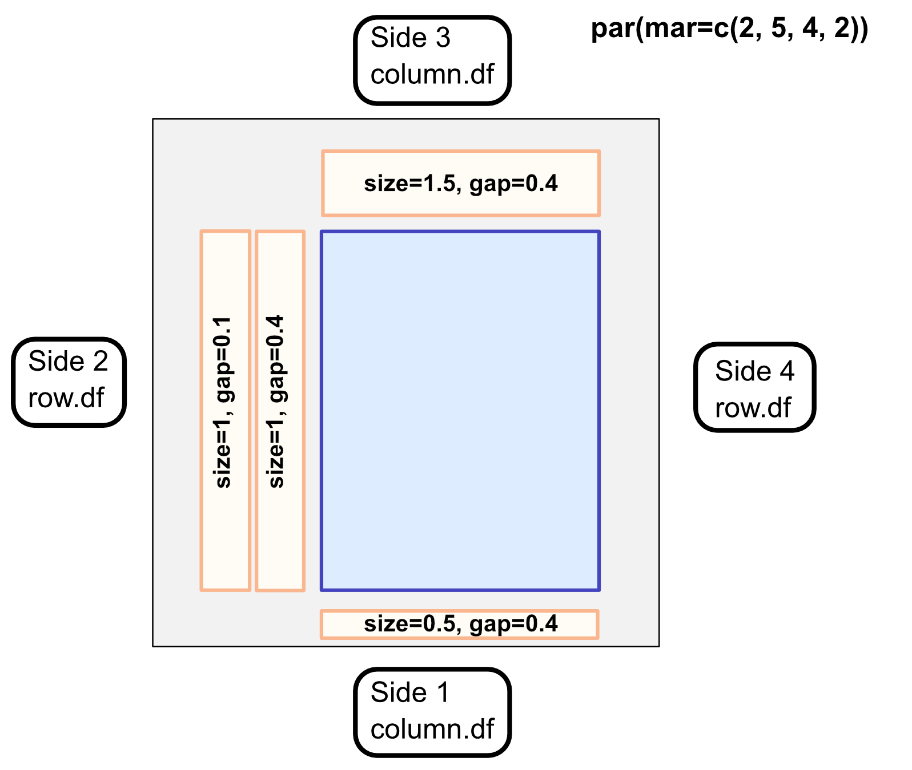
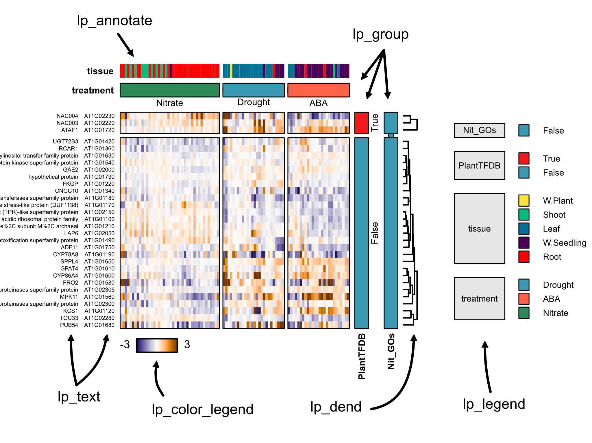

<p align="center"></p>

A modular heatmap library for R-base graphics
 
## But why?
There are many excellent fully featured heatmap/plot libraries. While those may be excellent for data exploration, they often produce images which are difficult to get to **"publication quality"**. Figure quality is *essential* for demonstration of your data and this is no more relevant than with heatmaps, which can be notorious for being inscruitably dense. 

This package is meant to address a couple of what I see as a couple common problems which are **hard to fix in other tools:**

* **Color control poorly tuned** to the data type (zero-centered data vs magnitude data).
* **Unlabeled annotations**, usually relying on matching games with indistinct colors.
* **No flexiblity in the orientation**, or manner of annotated attributes (sides, different formats).
* **No tiers of organization**, usually relying on clustering/not clustering as the only form of ordering.

# Basics of nheatmap 

### Structure

<p align="center"></p>
Heatmaps are complicated, there is no avoiding that. Instead, nheatmap tries to fit all essential data for plotting into 3 tables.  

These are:

* `value.df` - a matrix or dataframe which contains only numerical data. This makes up the "heat" portion of the plot, with **rownames** and **colnames** as essential keys to connect to attribute tables.
* `row.df` - a dataframe which contains all of the attributes for the rows of the plot. **Rows** of this dataframe correspond to the **rows** of the `value.df`. This can include an arbitrary number of columns, which make up the attributes. Usually, these are categorical data but it's not required in case your dataframe has other superfluous columns in it.
* `column.df` - Just like the `row.df`, except matching the columns of the plot. **Rows** of this dataframe correspond to the **columns** of the `value.df`

You can easily test the assumptions for naming like this:
```
## setequal() can tell if they have the same values (order is unimportant)
setequal(row.names(row.df), row.names(value.df))
[1] TRUE
setequal(row.names(column.df), col.names(value.df))
[1] TRUE

## reordering the value.df based on names can also do this.
value.df[row.names(row.df), row.names(column.df)] ## should return no errors.
```

*Note:* `row.df` and `column.df` are not required, but are almost certainly necessary to annotate the plot with layers (where the magic lives).

---
### Invocation
This function is modular, so it relies on multiple commands to build a complete plot. The main command is `nheatmap()`, which will produce the unannotated plot. The output of this will be saved and passed into subsequent commands to add layers to the annotation.

```
nh <- nheatmap(nh, value.df=value.df, column.df=column.df, row.df=row.df, column_groups=c("groupA"))

nh <- nheatmap_group(nh, side=3, gname='groupA')
nh <- nheatmap_dend(nh, side=2, lwd=2)
nh <- nheatmap_annotate(nh, side=1, aname='anotherColumn')
```


---
### Common plotting principles


<p align="center"></p>

***Sides***  
Layer-functions add a layer feature next to the plot, with the side corresponding to r-plotting sides:
`(1-bottom, 2-left, 3-top, 4-right)`  
Sides make it important to give the correct attribute names for the sides:
`(sides 1,3 ~ column.df, sides 2,4 ~ row.df)`

***Proportion***  
The general plotting area and layers are spatially defined in terms of proportion. In the initial plot invocation, this is given by the option default `plot_margin=c(0.2,0.2,0.2,0.2)`. 
This means that all sides have margin space for layers corresponding to 20% of the total plot dimension on that axis. 

Layers are added under the same principle, with proportion describing the width/height of that layer in regard to the axis.


---
### Grouping

Sometimes, you want to show heatmaps where some attributes are grouped together and won't inter-mingle with other groups upon clustering. This is a core-feature of nheatmap, and allows the user to highlight multiple layers of groups in the data for each axis.

Groups are derived from attribute columns in the `row.df` and `column.df`. As these affect the actual plotting order and dimensions of the heatmap, these must be specified in the initial invocation of `nheatmap()` using the following options:
* `row_groups` and/or `col_groups` - vectors of which columns for the respective dataframes should be grouped. These values must be found in the attributes columns of those dataframes.
* `group_gap` - the distance (in proportion of plotting area) by which groups should be separated. Default = 0.02.

Group layers can be added using the `nheatmap_group()` function. Multiple group layers may be plotted, if multiple group attributes were specified.

---
### Other layers

Several other layer functions allow building a custom plot.

`nheatmap_dend()` adds a dendrogram for sides that have been hierarchically clustered. This accepts many line-related options from r-base plotting.

`nheatmap_annotate()` adds colored category annotations. These are unlabeled and generally useful to see how clustering relates to categories.

`nheatmap_text()` adds text labels to an axis. Useful to show gene names, symbols (or both!). A r-base character related options.

---
### Colors
Colors will automatically be provided from default hcl.colors palettes. For all layers, colors can be specified as a named vector, with the names corresponding to attribute conditions. This can be easily made with `setNames()`:
```
color_vector = setNames(colors, conditions)
```
Any unnamed colors will be substituted from palettes.


# Examples

```
column.df <- read.delim("test/columns.txt")
column.df$treatment <- factor(column.df$treatment, levels=c("Nitrate", "Drought", "ABA"))

row.df <- read.delim("test/rows.txt")
value.df <- read.delim("test/values.txt")

nh = nheatmap(value.df, zero_centered_colors = T,
                  column.df=column.df, row.df=row.df,
                  column_groups=c('treatment'), row_groups=c("PlantTFDB", 'Nit_GOs'),
              cluster_cols=T,
              group_gap = 0.02,
              plot_margin = c(0.1,0.5,0.4,0.2))

nh = nheatmap_group(nh, 3, 'treatment', labels=T, prop=0.1, label_just = 'left',
                    col=setNames(c('seagreen','tomato'), c('Nitrate','ABA')))
nh = nheatmap_annotate(nh, 3, 'tissue', prop=0.05, label_just = 'left',
                       col=setNames('red', 'Root'))

nh = nheatmap_group(nh, 4, 'PlantTFDB', labels=F, prop=0.05, label_just = 'left')
nh = nheatmap_group(nh, 4, 'Nit_GOs', labels=F, prop=0.05, label_just = 'left')

nh = nheatmap_names(nh, 2, prop=0.15, cex=0.5)
nh = nheatmap_names(nh, 2, "symbol", cex=0.5)
nh = nheatmap_dend(nh, 4, lwd=1)
```


<p align="center">


